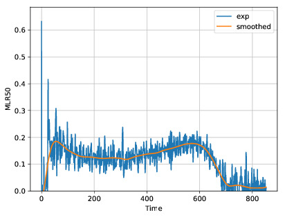

=======
Filters
=======

Pyropython contains a few simple routines for filtering data. Most users will still probably want to 
do any needed filtering pof data manually. By default, no filters are used. 

The filters are invoked by the **filter** keyword in the variable definitions under  **simulation** and **experiment**
keywords in the configuration file.  Available filters are:

1. **ma** - moving average
2. **median** - median filter
3. **gp** - gaussian process

Both the moving average and median filters accept an optional **width** parameter. The parameter can be given on the
data line with the **filter_opts** keyword as follows:

.. code-block:: yaml

	MLR35: 
		fname: 'Experimental_Data/Birch_35kW.csv'
		dep_col_name: 'MLR'
		header: 1
		filter_type: median
		filter_opts:
			width: 31

The default width for median and moving average filters is 10 samples. Note that boths median and moving average filters 
assume uniform sampling of the input.

The Gaussian process filter works by fitting a `Gaussian process`_ model to the data and then using the expected value 
of the gaussian priocess as the filtered value (Gaussian process regression).  Fitting a model can take up even several minutes 
for datasets with thousands of samples. However, the Gaussian process "filter" automatically determines its parameters and
does not assume uniform sampling. 

.. _Gaussian process:  http://scikit-learn.org/stable/modules/gaussian_process.html

The effect of the filter can be investigated using the *plot_pyro* tool. See the section :ref:`Plotting` 
for more information. For example, the following input (borrowed from `Birch_Cone_Example`_)

.. _Birch_Cone_Example: https://github.com/PyroId/PyroPython/tree/master/examples/Birch_Cone_Example

.. code-block:: yaml

	MLR35: 
		fname: 'Experimental_Data/Birch_35kW.csv'
		dep_col_name: 'MLR'
		header: 1
		filter_type: gp

Produces the following result: (The image is produced by plot_pyro)

